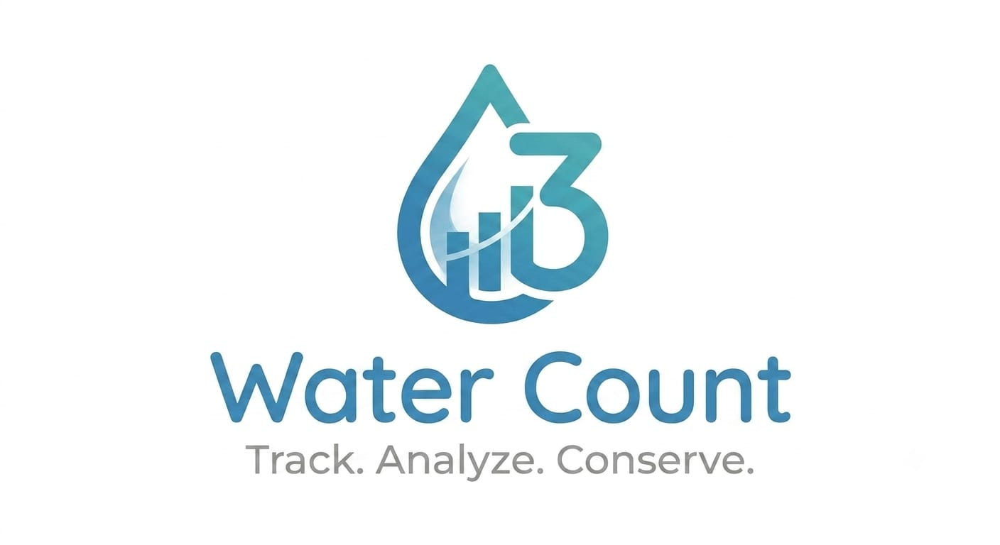

# 💧 Water Count

<p align="center">
  
</p>

<h1 align="center">💧 Water Count</h1>

<p align="center">
  <strong>A Simple, Smart & User-Friendly Water Management System</strong>
</p>

<p align="center">
  📦 Order Management • 💧 Bottle Counting • 💰 Payment Tracking • 📊 Record Management
</p>

<p align="center">


</p>

---

## 📖 About The Project

**Water Count** is a modern and lightweight web-based application designed to make **water bottle order, quantity, and payment management** simple and efficient. 💧📦💰

The application provides a user-friendly interface that helps users manage water-related records digitally instead of relying entirely on manual calculations and record keeping.

Built with **HTML5, CSS3, and JavaScript**, the project is lightweight, fast, and easy to run.

The repository also includes a **Web App Manifest** and **Service Worker**, making the project suitable for Progressive Web App (PWA) functionality. 📱⚡

---

## ✨ Key Features

### 💧 Water Bottle Management

* 🔢 Track bottle quantities
* 🧮 Calculate totals efficiently
* 📦 Manage water bottle-related records
* ⚡ Reduce manual calculations

### 📦 Order Management

* ➕ Add and manage orders
* 📋 View order information
* 🔄 Update order records
* 🆔 Keep order information organized

### 💰 Payment Tracking

* 💵 Record payment information
* 📊 Keep payment records organized
* 🧮 Simplify payment calculations
* 📋 Maintain transaction-related information

### 💾 Local Data Management

* ⚡ Fast browser-based operation
* 💻 No complex backend setup required
* 🔄 Data can be managed directly through the application

### 📱 Progressive Web App Support

The project includes:

* 📄 `manifest.json`
* ⚙️ `sw.js`

These files provide the foundation for **Progressive Web App (PWA)** functionality, allowing the application to behave more like an installable web application on supported devices.

---

## 🛠️ Technologies Used

| Technology            | Purpose                             |
| --------------------- | ----------------------------------- |
| 🌐 **HTML5**          | Application structure               |
| 🎨 **CSS3**           | UI design and styling               |
| ⚡ **JavaScript**      | Application logic and interactivity |
| 📱 **PWA**            | Web-app functionality               |
| ⚙️ **Service Worker** | Caching/offline capabilities        |
| 📄 **Web Manifest**   | PWA configuration                   |

---

## 📂 Project Structure

```text
water-count-/
│
├── 📁 .vscode/
│
├── 📄 .gitignore
├── 🌐 index.html
├── ⚡ script.js
├── 🎨 style.css
├── 📱 manifest.json
├── ⚙️ sw.js
├── 🖼️ water-count-logo.png
└── 📖 README.md
```

---


## 🖥️ How It Works

The application follows a simple frontend architecture:

```text
👤 User
   │
   ▼
🌐 Web Interface
   │
   ├── 💧 Water Management
   ├── 📦 Order Management
   ├── 💰 Payment Tracking
   └── 📊 Record Management
   │
   ▼
⚡ JavaScript Logic
   │
   ▼
💾 Browser Storage / Web APIs
```


## ## 📸 Demo Preview

👉 View the project here:

https://rahul-cse324.github.io/water-count-/

---

## 📱 Progressive Web App

The project contains PWA-related files:

### 📄 `manifest.json`

Defines application information such as:

* 📱 Application name
* 🖼️ Application icons
* 🎨 Display configuration
* 🌐 Start URL
* 📐 Application behavior

### ⚙️ `sw.js`

The Service Worker can be used to provide:

* ⚡ Faster loading
* 💾 Resource caching
* 🌐 Offline functionality
* 📱 PWA support

---

## 🎯 Project Objectives

The main objectives of **Water Count** are:

* 💧 Digitize water bottle management
* 📦 Simplify order tracking
* 💰 Organize payment records
* 🧮 Reduce manual calculations
* ⚡ Make daily management faster
* 📱 Provide a modern web-based experience
* 🌐 Build a practical real-world application

---

## 🧠 Learning Outcomes

This project demonstrates practical knowledge of:

* 🌐 HTML5
* 🎨 CSS3
* ⚡ JavaScript
* 🧩 DOM Manipulation
* 💾 Browser Storage
* 📱 Progressive Web Apps
* ⚙️ Service Workers
* 📄 Web App Manifest
* 🖥️ Frontend Application Development
* 🐙 Git & GitHub

---

## 🔮 Future Improvements

The project can be enhanced with:

* 👤 Customer management
* 🔐 User authentication
* ☁️ Cloud database
* 📊 Advanced dashboard
* 📈 Sales analytics
* 📅 Date-wise reports
* 🔍 Search and filter
* 🧾 Automatic invoice generation
* 🖨️ Printable receipts
* 📥 Excel/PDF export
* 🔔 Notifications
* ☁️ Multi-device synchronization
* 📱 Advanced PWA features

---


## 👨‍💻 Developer

### Rahul Das

💻 Computer Science & Engineering
🌐 Web Developer
🔐 Cyber Security Enthusiast
🚀 Passionate about building practical applications


---


## 📜 License

This project is developed for **educational and personal development purposes**.

Feel free to explore the source code and learn from the project. 🚀

---

<p align="center">

## 💧 Water Count

**Manage Water • Track Orders • Record Payments • Stay Organized**

### Made with ❤️ using HTML, CSS & JavaScript

</p>
